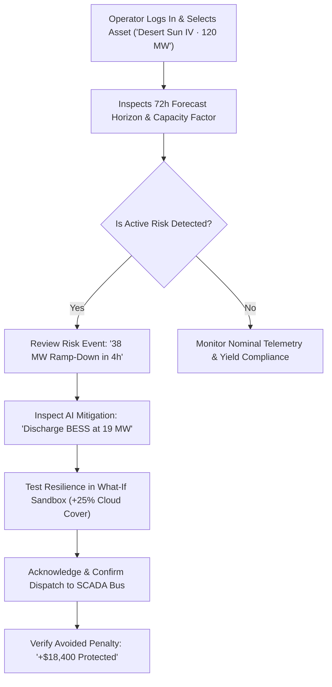

# 00 — Product Requirements Document (PRD)

> **Document:** `docs/00_PRD.md`  
> **Product Name:** RenewableIQ  
> **Classification:** Production-Grade Energy-Tech SaaS  
> **Target Release:** Hackathon MVP to Commercial Architecture  

---

## 1. Product Statement

**RenewableIQ** is an AI-powered renewable generation forecasting and grid intelligence platform that transforms stochastic weather data into predictable power trajectories, automated hazard detection, and prescriptive grid mitigation actions.

---

## 2. Problem Statement

Renewable power generation (solar photovoltaics and wind) is fundamentally variable and non-dispatchable:
* It fluctuates dynamically across seconds, hours, and seasons due to atmospheric irradiance, cloud occlusion fronts, temperature-induced inverter derating, and wind shears.
* Sudden **ramp-down events** (e.g., losing 40 MW of generation in under 30 minutes) threaten grid frequency stability and trigger costly ancillary peaker plant spin-ups.
* Balancing authorities enforce severe **deviation penalties** when actual plant yield diverges from day-ahead market schedules.
* Plant operators and transmission engineers lack an integrated system that connects weather forecasts to physical asset constraints and actionable dispatch decisions.

---

## 3. Product Goal

To forecast utility-scale renewable generation continuously over a **24–72 hour rolling horizon**, quantify forecast uncertainty through probabilistic confidence envelopes (\(P_{10} \dots P_{90}\)), detect imminent ramp and under/over-generation anomalies, and synthesize autonomous, executable mitigation recommendations for operators.

---

## 4. Target Users & Personas

### 4.1 Primary Users
1. **Renewable Plant Operators:** On-site engineers and remote operations center (ROC) technicians responsible for active output, inverter uptime, and substation telemetry.
2. **Grid Reliability Operators & Dispatchers:** Transmission System Operators (TSOs) and Independent System Operators (ISOs) balancing regional frequency and feeder congestion.
3. **Utility Balancing Teams:** Power schedulers managing hourly interconnect compliance.

### 4.2 Secondary Users
1. **Clean Energy Asset Managers & IPPs:** Executives optimizing asset yield, PPA performance, and battery storage degradation.
2. **Energy Traders & Risk Analysts:** Trading desks managing day-ahead bid exposure and real-time nodal price arbitrage.

---

## 5. Detailed User Personas

### Persona 1: Elena Rostova — Lead Grid Dispatch Engineer (TSO)
* **Role & Context:** Manages balancing authority dispatch for a regional grid with 45% renewable penetration.
* **Goals:** Maintain grid frequency at 60.00 Hz (±0.02 Hz tolerance); minimize expensive spinning reserve calls.
* **Pain Points:** Traditional NWP reports are static, delivered 4 times daily, and fail to predict sub-hourly convective cloud fronts.
* **Key Decisions:** When to order battery pre-charging, when to issue curtailment directives, and when to dispatch peaking thermal units.
* **Required Information:** High-confidence 72h ramp rate predictions (MW/min), probability of exceedance, and multi-asset aggregate horizon.

### Persona 2: Marcus Vance — VP of Asset Optimization (IPP Portfolio Owner)
* **Role & Context:** Oversees 850 MW of utility-scale solar and co-located BESS across 12 facilities.
* **Goals:** Protect fund EBITDA by eliminating CAISO/ERCOT imbalance penalties; maximize energy sales during peak LMP windows.
* **Pain Points:** Under-generation penalties during afternoon summer peaks erode quarterly profits by up to 22%.
* **Key Decisions:** How much capacity to bid into the Day-Ahead Market vs. Real-Time Market; optimal BESS charge/discharge timing.
* **Required Information:** Dollar-denominated risk exposure, schedule deviation delta (MW), and battery cycle efficiency impact.

### Persona 3: Tariq Al-Mansoor — On-Site Plant Operations Specialist
* **Role & Context:** Responsible for physical maintenance, inverter availability, and tracker operations at a 120 MW solar farm.
* **Goals:** Ensure string availability > 99%; prevent thermal tripping during extreme heat events.
* **Pain Points:** Fragmented vendor portals with zero predictive intelligence.
* **Key Decisions:** Whether to schedule string washing or maintenance based on upcoming generation lulls.
* **Required Information:** Array ambient temperature, GHI forecasts, inverter status flags, and clipping thresholds.

---

## 6. Core Product Capabilities

1. **Generation Forecasting:** Continuous rolling 24–72 hour ensemble forecasts incorporating historical SCADA telemetry and numerical weather prediction.
2. **Weather Intelligence:** Real-time on-site atmospheric telemetry (Global Horizontal Irradiance, Cloud Cover %, Ambient Temperature, Wind Speed).
3. **Risk Detection:** Automated identification of under-generation, over-generation, thermal clipping, and schedule mismatch.
4. **Ramp Detection:** Specialized anomaly classification tracking steep upward/downward rate-of-change events (>20% loss within 30 minutes).
5. **Action Recommendations:** Prescriptive guidance following the strict **Risk → Root Cause → Action → Impact** decision architecture (e.g., automated BESS discharge setpoints).
6. **Economic Impact:** Real-time quantification of avoided imbalance penalties and revenue optimization.
7. **Environmental Impact:** Calculation of equivalent carbon emissions displaced (\(\text{MT CO}_2\text{e}\)) by avoiding fossil backup generation.
8. **Scenario Analysis:** Interactive What-If sandbox simulating weather anomalies (e.g., +25% cloud cover surge) and hardware deratings.

---

## 7. MVP Scope & Priority Matrix (P0 / P1 / P2)

```
┌────────────────────────────────────────────────────────────────────────┐
│                        MVP SCOPE SPECIFICATION                         │
├────────────────────────────────────────────────────────────────────────┤
│ P0: MANDATORY MVP CORE                                                 │
│ • Plant configuration & digital twin parameters (120 MW Solar + BESS)  │
│ • Real-time weather ingestion & atmospheric telemetry display          │
│ • 24h / 48h / 72h continuous forecast generation                       │
│ • High-performance SVG forecast chart (Actuals, Predicted, P10/P90)   │
│ • Automated ramp and under-generation risk detection engine            │
│ • Action recommendation card with 1-click SCADA dispatch modal         │
│ • Mission-critical operator dashboard shell & KPI metric ribbon        │
│ • Deterministic, zero-crash demo fallback dataset                      │
├────────────────────────────────────────────────────────────────────────┤
│ P1: HIGH-VALUE DIFFERENTIATORS                                         │
│ • Interactive What-If Scenario sandbox with reactive diff chart        │
│ • Granular Actual vs. Predicted error tracking (MAPE / RMSE)           │
│ • Real-time economic penalty avoidance calculator                      │
│ • Environmental equivalent offset metrics                              │
│ • Pinned 5-stage landing page storytelling visual                      │
├────────────────────────────────────────────────────────────────────────┤
│ P2: POST-HACKATHON COMMERCIAL EXPANSION                                │
│ • Multi-site fleet portfolio aggregation                               │
│ • Advanced battery degradation electrochemical modeling                │
│ • Direct IEC 61850 / DNP3 hardware SCADA bridge                        │
│ • Offshore wind turbine wake-loss modeling                             │
└────────────────────────────────────────────────────────────────────────┘
```

---

## 8. Functional Requirements (Testable & Measurable)

| ID | Requirement Statement | Verification Method |
| :--- | :--- | :--- |
| **FR-001** | The system shall display the active plant name, nominal DC/AC capacity, and grid interconnection node ID. | Visual UI inspection on header & plant page. |
| **FR-002** | The system shall render a continuous 72-hour generation forecast at 1-hour minimum resolution. | Chart verification of 72 discrete data points. |
| **FR-003** | The system shall display probabilistic uncertainty intervals representing 10th (\(P_{10}\)) and 90th (\(P_{90}\)) generation percentiles. | Toggleable shaded area on forecast chart. |
| **FR-004** | The system shall allow users to toggle between 24h, 48h, and 72h forecast horizons without page reload. | Tab switch updates chart time domain in < 100ms. |
| **FR-005** | The system shall automatically flag ramp events where generation changes by more than 20% within a 30-minute window. | Alert badge triggered on Hour 18 test data. |
| **FR-006** | The system shall categorize risk events into four severity tiers: `CRITICAL`, `HIGH`, `MEDIUM`, and `LOW`. | Filter toolbar in `/risks` sorts ledger accurately. |
| **FR-007** | The system shall generate actionable mitigation recommendations linking risk, root cause, prescribed action, and financial impact. | Recommendation card inspection in `/recommendations`. |
| **FR-008** | The system shall provide an interactive dispatch confirmation modal that records simulated operator acknowledgment. | Modal trigger updates dispatch status to "Dispatched". |
| **FR-009** | The system shall provide interactive sliders allowing operators to simulate shifts in cloud cover (±50%) and observe generation deltas. | Scenario sandbox recalculates diff curve dynamically. |
| **FR-010** | The system shall display real-time on-site weather telemetry including GHI (\(\text{W/m}^2\)), cloud opacity %, temperature, and wind speed. | Weather ribbon renders correct tabular values. |
| **FR-011** | The system shall calculate estimated avoided imbalance penalties in USD using configurable PPA and penalty rates. | Metric card displays `+$14,280` on demo dataset. |
| **FR-012** | The system shall display carbon displacement metrics (\(\text{MT CO}_2\text{e}\)) based on clean energy generated. | Environmental impact widget renders calculated stat. |
| **FR-013** | The system shall maintain continuous operation using deterministic demo data if the external backend API fails or is unreachable. | Network disconnect test maintains full UI fidelity. |
| **FR-014** | All numerical readouts shall render using tabular lining numerals (`tabular-nums`) to prevent layout jitter. | CSS inspection confirms OpenType `tnum` feature. |

---

## 9. Non-Functional Requirements (NFRs)

* **Performance:**
  - Largest Contentful Paint (LCP) `< 1.2s` on desktop broadband, `< 1.8s` on 4G cellular.
  - Cumulative Layout Shift (CLS) `= 0.00`.
  - Chart tooltip hover latency `< 16ms` (60 fps frame rate).
* **Accessibility (a11y):**
  - Full WCAG 2.1 Level AA compliance.
  - Contrast ratios exceeding 4.5:1 for body copy and 3.0:1 for graphical elements.
  - Accessible screen-reader tabular fallbacks for all visual time-series charts.
  - Full keyboard accessibility with high-contrast visible focus rings.
* **Responsiveness:**
  - Complete operational parity across 1440px (wide desktop), 1280px (laptop), 1024px (tablet landscape), 768px (tablet portrait), and 390px (mobile).
* **Reliability & Resilience:**
  - Zero unhandled JavaScript exceptions on empty or malformed API responses.
  - Graceful fallback with user-visible demo badge (`● DEMO SIMULATION MODE`).
* **Maintainability & Architecture:**
  - Strict TypeScript with zero `any` declarations.
  - Clean separation: presentation components consume typed services; ML logic remains isolated on the backend.

---

## 10. Success Criteria (Hackathon Judging Targets)

1. **Immediate Comprehension:** Judges understand the platform value within **15 seconds** of viewing the landing hero and forecast preview.
2. **Commercial Believability:** The interface looks like enterprise utility software (GE Vernova, Siemens Energy, Fluence) rather than an AI hackathon template.
3. **Flawless Live Demo:** Zero runtime crashes or broken layout elements during the live walkthrough.
4. **Interactive Responsiveness:** Sliders in the What-If Scenario sandbox update the simulated generation curve smoothly in real time.

---

## 11. Explicit Out-of-Scope Items (For Hackathon)

* Real-time automated physical SCADA writeback to live high-voltage grid substations (simulated confirmation only).
* Multi-tenant enterprise SSO / SAML authentication (mock session used).
* Live weather radar satellite streaming WebGL shaders.
* Native mobile iOS/Android app builds (mobile web responsive parity prioritized).

---

## 12. Primary User Journey



---

## 13. Step-by-Step Judge Demo Scenario

1. **The Hook (0:00 – 0:30):**  
   Open the Landing Page. Showcase the headline *"Make renewable generation predictable."* Hover over the live 72-hour forecast preview visual, highlighting the difference between deterministic prediction and the \(P_{10}/P_{90}\) uncertainty band.
2. **The Problem (0:30 – 1:00):**  
   Scroll down through the 5-stage storytelling pipeline (*Weather → Forecast → Risk → Action → Impact*), demonstrating how a cloud front creates a 38 MW generation cliff.
3. **The Control Room (1:00 – 2:00):**  
   Click `Explore the Platform` to enter `/dashboard`. Point out the live UTC clock, active plant status (120 MW), and the Active Risk Card flagging the incoming 18:30 UTC ramp-down event.
4. **The Decision Engine (2:00 – 2:45):**  
   Navigate to `/recommendations`. Review the **Risk → Root Cause → Action → Impact** card. Click `Acknowledge & Dispatch to SCADA Bus` to trigger the confirmation modal and show simulated execution.
5. **The What-If Sandbox (2:45 – 3:30):**  
   Navigate to `/scenarios`. Drag the Cloud Cover slider to `+30%`. Watch the simulated curve drop in real-time and point out the financial exposure delta.
6. **Closing (3:30 – 4:00):**  
   Conclude on the plant digital twin settings (`/plant`) and show responsive tablet/mobile view, reiterating that RenewableIQ turns weather volatility into operational precision.
