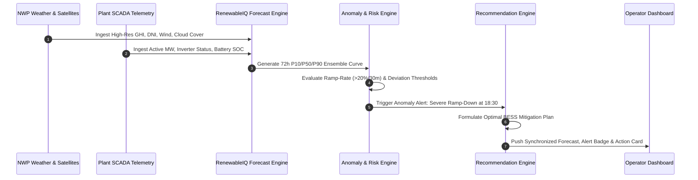

# 01 — Product Vision & Strategic Framing

> **Document:** `docs/01_PRODUCT_VISION.md`  
> **Parent Architecture:** [UI_UX_MASTER_PLAN.md](file:///home/ommistry223/DAIICT/docs/UI_UX_MASTER_PLAN.md)  
> **Status:** Approved Baseline  

---

## 1. Commercial Thesis

The global transition to variable renewable energy (VRE)—predominantly utility-scale solar photovoltaics and wind turbines—has introduced unprecedented volatility into modern transmission and distribution grids. While fuel-fired thermal generation was historically dispatchable on command, renewable generation is governed by atmospheric thermodynamics.

**RenewableIQ** solves the fundamental commercial and physical challenge of modern energy:
> **How do asset managers and grid dispatchers operate intermittent generation with the reliability, safety margins, and economic predictability of a conventional power plant?**

### The Three Interconnected Market Pressures
1. **Financial Penalty Escalation:** Transmission System Operators (TSOs) and Independent System Operators (ISOs) increasingly penalize generator deviations between day-ahead scheduled commitments and real-time generation. In markets like CAISO, ERCOT, and EPEX, unhedged deviation costs can erode 12–28% of annual plant EBITDA.
2. **Inverter & Ramp-Induced Grid Instability:** Steep ramp-down rates (e.g., losing 40 MW of solar output within 20 minutes due to cloud occlusion) destabilize local feeder frequency and trigger automatic curtailment orders or expensive reserve spin-up.
3. **Storage Misallocation:** Co-located Battery Energy Storage Systems (BESS) are frequently cycled inefficiently due to crude heuristics rather than predictive, physics-grounded forecast intelligence.

---

## 2. Target Personas & Core Workflows

### Persona A: Elena Rostova — Lead Dispatch Engineer (Transmission Operator / ISO)
* **Context:** Elena oversees balancing authority operations covering a 4.2 GW regional grid mix with 48% renewable penetration.
* **Pain Point:** Elena receives disjointed radar imagery, coarse 3-hour regional NWP outputs, and raw SCADA alarms. During sudden frontal passages, she has less than 15 minutes to decide whether to fire up expensive natural gas peaker plants.
* **RenewableIQ Value:** Provides a continuous 72-hour rolling regional ramp forecast, clustering plants into high-risk ramp corridors, with automated reserve margin alerts.

### Persona B: Marcus Vance — VP of Asset Optimization (IPP / Renewable Fleet Owner)
* **Context:** Marcus manages 850 MW of utility-scale solar and co-located storage across 14 geographical nodes.
* **Pain Point:** Under-generation penalties during summer afternoon peaks cost his fund hundreds of thousands of dollars quarterly. His field teams operate in silos without an integrated dispatch and trading playbook.
* **RenewableIQ Value:** Translates raw forecast deltas into exact BESS dispatch schedules and financial impact assessments, allowing Marcus's trading desk to hedge power contracts hours in advance.

### Persona C: Tariq Al-Mansoor — Renewable Plant Operations Technician
* **Context:** On-site operator responsible for daily string-level uptime, inverter health, and substation coordination.
* **Pain Point:** Constantly toggling between manufacturer-specific inverter portals and internal emails to understand why curtailment was mandated.
* **RenewableIQ Value:** Single-pane-of-glass plant overview showing physical capacity vs. real-time expected generation, localized weather telemetry, and recommended sub-array operations.

---

## 3. Product Capabilities Matrix

| Capability Area | Legacy Workflow | RenewableIQ Commercial Standard |
| :--- | :--- | :--- |
| **Forecasting Horizon** | Static 24-hour day-ahead PDF report issued once daily at 06:00. | Dynamic rolling 24–72h horizon updated every 15 minutes with real-time NWP + satellite assimilation. |
| **Uncertainty Quantification** | Single deterministic curve with no confidence boundaries. | Probabilistic quantile forecasting (\(P_{10}\), \(P_{50}\), \(P_{90}\)) visualizing meteorological dispersion. |
| **Risk Detection** | Manual monitoring of SCADA alarms after the threshold has breached. | Predictive anomaly detection flagging ramp events, clipping losses, and curtailment risks 2–18 hours ahead. |
| **Operational Guidance** | Operators rely on intuition or static operating procedure binders. | Context-aware decision intelligence specifying exact battery discharge MW, schedule re-bids, or reactive support. |
| **Scenario Modeling** | Offline Excel modeling requiring hours of manual data formatting. | Real-time interactive What-If simulation engine with instant financial and ramp delta calculations. |

---

## 4. End-to-End Intelligence Pipeline

---

## 5. Success Metrics & Validation Targets

1. **Forecast Accuracy:** Deliver \(\le 4.8\%\) Mean Absolute Percentage Error (MAPE) on day-ahead solar forecasting across normal irradiance conditions.
2. **Alert Lead Time:** Provide a minimum of **90 minutes** advance warning for rapid ramp-down events exceeding 25 MW.
3. **Decision Latency:** Operators must be able to review, assess, and dispatch a recommended mitigation in fewer than **4 clicks** or **30 seconds**.
4. **Economic ROI Proof:** Quantify penalty savings in real-time on the operator dashboard, displaying cumulative avoided reserve costs.
