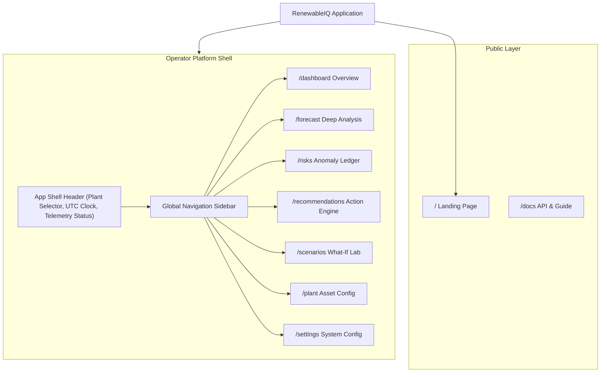

# 02 — Information Architecture & Navigation Hierarchy

> **Document:** `docs/02_INFORMATION_ARCHITECTURE.md`  
> **Parent Architecture:** [UI_UX_MASTER_PLAN.md](file:///home/ommistry223/DAIICT/docs/UI_UX_MASTER_PLAN.md)  
> **Status:** Approved Baseline  

---

## 1. Application Sitemap & Routing Topology

RenewableIQ is structured around an industrial control-room operational pattern. Navigation separates high-level public presentation from the high-density operational workbench.

```
/
├── (Landing Page: Public Showcase)
├── /dashboard                      [Primary Operational Control Surface]
├── /forecast                       [Deep 72h Time-Series Forecasting & Analysis]
├── /risks                          [Risk Event Ledger & Anomaly Detection]
├── /recommendations                [Decision Support & Action Dispatch Engine]
├── /scenarios                      [What-If Simulation Sandbox]
├── /plant                          [Plant Digital Twin & Telemetry Configuration]
├── /settings                       [Alert Rules, Notification Webhooks, RBAC]
└── /docs                           [API Specifications & Mathematical Methodology]
```

---

## 2. Navigation Architecture



### 2.1 Navigation Shell Elements

#### 1. Global Navigation Rail / Sidebar (`<AppSidebar />`)
Fixed on the left viewport for desktop (\(\ge 1024\text{px}\)), collapsible into a dense icon-only rail or slide-out drawer on mobile/tablet (\(< 1024\text{px}\)).
* **Brand Logo:** Compact industrial crest + "RenewableIQ" wordmark.
* **Primary Navigation Links:**
  - `Dashboard` (Icon: `LayoutDashboard`)
  - `Forecast` (Icon: `TrendingUp`)
  - `Risk Intelligence` (Icon: `AlertTriangle` + live counter badge for unresolved high-severity alerts)
  - `Recommendations` (Icon: `Zap` + counter badge for pending dispatches)
  - `Scenario Sandbox` (Icon: `SlidersHorizontal`)
  - `Plant Digital Twin` (Icon: `Sun`)
* **Utility Group (Bottom):**
  - `Settings` (Icon: `Settings`)
  - `Documentation` (Icon: `BookOpen`)
  - `System Connection Pulse` (Real-time telemetry heartbeat: "SCADA Live — 14ms latency")

#### 2. Top Telemetry Header (`<AppHeader />`)
Sticky global header present across all operational routes:
* **Active Plant Context:** Dropdown selector (`Desert Sun Farm IV — 120 MW`, `North Valley Wind — 80 MW`, `All Fleet Aggregate`).
* **Operational Clock:** High-precision dual-time display: `UTC 14:22:08` | `Local 07:22:08`.
* **Horizon Preset Quick-Pills:** `24h` | `48h` | `72h`.
* **Notification Popover:** Quick-drawer of critical alerts.
* **User Profile & Environment Badge:** (`Staging` / `Live Production`).

---

## 3. Route Specifications & Parameters

### 3.1 `/dashboard` — Master Operational Overview
* **Primary Focus:** High-level operational triage, current power vs nameplate, active ramp risk, and instantaneous mitigation.
* **Query Parameters Supported:**
  - `plantId` (string, e.g., `?plantId=desert-sun-4`)
  - `horizon` (`24h` | `48h` | `72h`, default: `72h`)

### 3.2 `/forecast` — Deep Time-Series Workbench
* **Primary Focus:** Detailed inspection of actual vs predicted generation, \(P_{10}/P_{50}/P_{90}\) intervals, and weather parameter overlays.
* **Query Parameters Supported:**
  - `plantId` (string)
  - `horizon` (`24h` | `48h` | `72h` | `custom`)
  - `overlays` (comma-separated: `ghi,temp,wind,cloud`)
  - `interval` (`15m` | `1h` | `4h`)
  - `view` (`chart` | `table` | `split`)

### 3.3 `/risks` — Anomaly Ledger
* **Primary Focus:** Categorized event ledger for grid stability hazards.
* **Query Parameters Supported:**
  - `severity` (`all` | `critical` | `high` | `medium` | `low`)
  - `category` (`ramp_down` | `ramp_up` | `undergen` | `overgen` | `weather`)
  - `status` (`active` | `acknowledged` | `resolved`)

### 3.4 `/recommendations` — Contextual Action Engine
* **Primary Focus:** Prescriptive mitigation workflows connecting risk to physical grid dispatches.
* **Query Parameters Supported:**
  - `filter` (`all` | `bess` | `market` | `curtailment` | `maintenance`)
  - `actionId` (string, opens specific modal/drawer)

### 3.5 `/scenarios` — What-If Analysis Laboratory
* **Primary Focus:** Predictive simulation sandbox for stress-testing assets against weather variations.
* **Query Parameters Supported:**
  - `preset` (`cloud_surge` | `heatwave` | `inverter_derate` | `wind_drop`)
  - `cloudCoverDelta` (number, -50 to +50)
  - `bessSoc` (number, 0 to 100)

### 3.6 `/plant` — Plant Configuration & Digital Twin
* **Primary Focus:** Telemetry setup, inverter mapping, BESS capacity, geographic parameters.
* **Sub-tabs:**
  - `general` (Metadata, Lat/Long, Interconnection node)
  - `pv-array` (Inverter count, strings, tilt/tracker azimuth)
  - `bess` (C-rate, MWh rating, degradation limits)
  - `tariffs` (PPA price, deviation penalties, peak windows)

### 3.7 `/settings` — Platform Configuration
* **Sub-tabs:**
  - `notifications` (Email, SMS, Webhook endpoints)
  - `thresholds` (Ramp alert sensitivities)
  - `model-params` (Ensemble weighting)
  - `audit-log` (Operator action history)

---

## 4. Contextual Breadcrumb Logic

Breadcrumbs are standardized across all sub-pages for control room orientation:
* `Dashboard > Plant: Desert Sun IV > Active Horizon: 72h`
* `Forecast > Deep Inspection > Hour 14–22 Ramp Event`
* `Risks > Critical Event #RK-8091 > BESS Mitigation`
* `Scenarios > Cloud Cover +25% Surge > Simulation Result`

---

## 5. State Management & URL Synchronization Strategy

To ensure control room screens can be shared via URL or bookmarked:
1. **URL as Single Source of Truth:** All filter states, selected plants, and time horizons sync directly to URL query parameters via Next.js `useSearchParams` and `useRouter`.
2. **Session Storage Fallback:** When a user navigates between pages without specifying query parameters, the active `plantId` and `horizon` persist in local session storage.
3. **Deterministic Demo State:** A global query flag `?demo=true` locks the application into the mock dataset regardless of backend network availability.
