# 18 — Phased Implementation Roadmap & Hackathon Delivery Plan

> **Document:** `docs/18_IMPLEMENTATION_ROADMAP.md`  
> **Parent Architecture:** [UI_UX_MASTER_PLAN.md](file:///home/ommistry223/DAIICT/docs/UI_UX_MASTER_PLAN.md)  
> **Status:** Approved Baseline  

---

## 1. Hackathon Priority Tiers (Strict P0 / P1 / P2 Matrix)

Given finite development velocity during a competitive hackathon, features are strictly triaged into three priority tiers. Under no circumstances may P2 features compromise P0 stability:

```
┌────────────────────────────────────────────────────────────────────────┐
│                        FEATURE PRIORITY MATRIX                         │
├────────────────────────────────────────────────────────────────────────┤
│ P0: CRITICAL PATH (MVP DEMO SHIPPER)                                   │
│ • Landing Page Hero with Custom 72h Interactive Energy Preview Visual  │
│ • Full Dashboard Shell with Real-time KPI Metric Ribbon                │
│ • 72-Hour Master Generation Forecast Chart (Recharts + P10/P90 bands)  │
│ • Real-time Risk Anomaly Detection Ledger (Ramp Warnings & Alerts)     │
│ • Prescriptive Action Recommendation Card (BESS Dispatch Workflow)    │
│ • Complete Responsive Parity (Desktop + Tablet + Mobile)               │
│ • Zero-Crash Deterministic Demo Mode Fallback                          │
├────────────────────────────────────────────────────────────────────────┤
│ P1: HIGH-VALUE DIFFERENTIATORS (COMMERCIAL AUTHORITY)                  │
│ • Pinned 5-Stage Scroll Pipeline Story (Weather → Action → Impact)    │
│ • Interactive What-If Scenario Sandbox with Live Diff Chart            │
│ • Plant Digital Twin Configuration Form (PV Arrays, BESS, Tariffs)     │
│ • Accessible Tabular Screen-Reader Fallbacks & High-Contrast Overrides │
├────────────────────────────────────────────────────────────────────────┤
│ P2: POLISH & SECONDARY ENHANCEMENTS (IF TIME PERMITS)                  │
│ • Advanced Webhook Integrations (Slack / PagerDuty simulator)          │
│ • Export to SCADA-compatible XML format                                │
│ • Historical forecast accuracy scorecard (MAPE / RMSE breakdown)       │
└────────────────────────────────────────────────────────────────────────┘
```

---

## 2. Phased Execution Timeline (Phase 0 – Phase 15)

```mermaid
gantt
    title RenewableIQ Phased Implementation Roadmap
    dateFormat  X
    axisFormat Phase %X

    section Architecture & Foundations
    Phase 0 (Repo Audit & Blueprint)     :done, 0, 1
    Phase 1 (Design Tokens & Typo)       :active, 1, 2
    Phase 2 (Global App Shell)           :2, 3
    Phase 3 (Navigation & Routes)        :3, 4

    section Core Product (P0)
    Phase 4 (Landing Page Core)          :4, 5
    Phase 5 (Landing GSAP Story)         :5, 6
    Phase 6 (Dashboard Shell & KPIs)     :6, 7
    Phase 7 (72h Forecast Chart)         :7, 8
    Phase 8 (Risk & Recs Engine)         :8, 9

    section Advanced Labs (P1)
    Phase 9 (What-If Scenario Lab)       :9, 10
    Phase 10 (Plant Digital Twin)        :10, 11

    section Hardening & Polish
    Phase 11 (Responsive Polish)         :11, 12
    Phase 12 (API & Demo Resiliency)     :12, 13
    Phase 13 (a11y & Contrast Audit)     :13, 14
    Phase 14 (Performance & Core Vitals) :14, 15
    Phase 15 (Final Demo Rehearsal)      :15, 16
```



### Phase 0: Repository Audit & Architecture (COMPLETE)
- Inspected workspace (`/home/ommistry223/DAIICT`).
- Generated master design documentation system in `docs/` (19 documents).

### Phase 1: Design Tokens & Typography Setup
- Establish CSS custom properties in `src/app/globals.css`.
- Configure `tailwind.config.ts` with exact color palette (`#F7F8F5`, `#167A4A`, `#0D4F32`, `#C98216`, `#C94A4A`, `#3978A8`).
- Configure Google Fonts (`Manrope` display, `Inter` body with tabular numerals).

### Phase 2: Global Layout & Application Shell
- Build `<AppShell />`, `<AppHeader />`, and collapsible `<AppSidebar />`.
- Implement responsive viewport containers and breadcrumb bars.

### Phase 3: Navigation & Routing Scaffolding
- Implement route pages: `/`, `/dashboard`, `/forecast`, `/risks`, `/recommendations`, `/scenarios`, `/plant`, `/settings`, `/docs`.
- Synchronize plant selection and time horizons to URL query parameters.

### Phase 4: Landing Page Core Sections (P0)
- Assemble `<LandingNavbar />`, `<HeroSection />`, `<ProofStrip />`, and `<CapabilitiesGrid />`.
- Build custom `<HeroForecastVisual />` demonstrating 72-hour forecast with live hover telemetry.

### Phase 5: Landing Page Animations & GSAP Storytelling (P1)
- Wire up GSAP ScrollTrigger for Section 07 (*Weather → Forecast → Risk → Action → Impact*).
- Integrate Lenis smooth scrolling with `prefers-reduced-motion` safety check.

### Phase 6: Dashboard Shell & KPI Ribbon (P0)
- Build `<KpiGrid />` featuring Plant Output, 72h Yield, Peak Forecast, and Active Risk Index.
- Integrate real-time dual UTC/Local operational clock.

### Phase 7: 72-Hour Master Forecast Visualization (P0)
- Implement `<EnergyLineChart />` with Recharts.
- Render Actual generation, Predicted ensemble curve, and \(P_{10} \dots P_{90}\) shaded confidence corridor.
- Add synchronized daytime/nighttime background bands and anomaly event flags.

### Phase 8: Risk Intelligence & Recommendation Action Engine (P0)
- Build `<ActiveRiskWidget />` and full `/risks` threat ledger.
- Implement `<RecommendationCard />` following the strict **Risk → Root Cause → Action → Impact** architecture.
- Construct `<ActionDispatchModal />` for simulated SCADA bus execution.

### Phase 9: What-If Scenario Sandbox UI (P1)
- Construct `/scenarios` with interactive parameter sliders (Cloud Cover Delta, BESS State of Charge).
- Render reactive diff chart comparing baseline generation vs shocked scenario.

### Phase 10: Plant Configuration & Digital Twin (P1)
- Build `/plant` parameterization form for PV modules, inverters, battery storage nameplate, and PPA tariffs.

### Phase 11: Responsive Parity & Mobile Touch Optimization (P0)
- Verify mobile breakpoint (390px): test touch targets, drawer menus, stacked KPI cards, and mobile chart scrubber.

### Phase 12: Backend Integration & Demo Fallback Resilience (P0)
- Wire up typed data hooks (`useForecast`, `useRisks`, `useRecommendations`).
- Test graceful offline fallback to `src/data/demo-data.ts` if API returns non-200.

### Phase 13: Accessibility Verification & Audit (P1)
- Test full keyboard tab order and focus-visible rings.
- Verify screen-reader tabular fallbacks for SVG charts.
- Audit color contrast across all warning and critical badges.

### Phase 14: Performance Tuning & Bundle Trimming (P0)
- Lazy load charts via `next/dynamic`.
- Verify Core Web Vitals (LCP < 1.5s, CLS = 0.00).

### Phase 15: Final Visual Polish & Control Room Demo Rehearsal (P0)
- Conduct end-to-end user journey dry run for judging panel.
- Confirm that all metrics, tooltips, and transitions appear authoritative, engineered, and commercial-grade.
